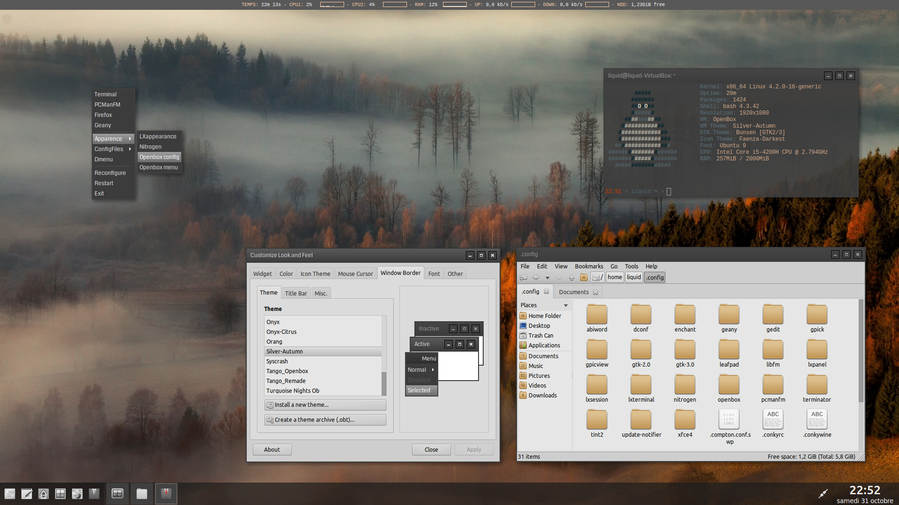

# Openbox WM
This repo regroups all the config files needed to create a clean Openbox desktop. 

### .config folder
* tint2rc			Tint2 panel configuration
* conkywine		Conky inline configuration
* compton.conf	Compton configuration
* autostart 		OB autostart file
* menu.xml		OB menu configuration
* rc.xml			OB setting and shortcuts

dmenu-bind.sh	Dmenu shortcut launcher

### Openbox folder
* .bashrc			Terminal configuration
* .Xresources		Font hinting

### OB menu note:
To add title to your Openbox menu, edit the ~/.config/openbox/menu.xml and add a label parameter to the separator. Weirdly, this can't be done through the obmenu tool.

    <separator label="Title"/>
